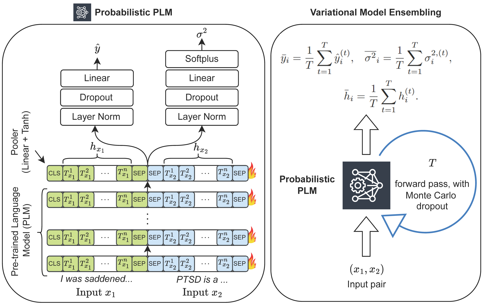

# UPLME: Uncertainty-Aware Probabilistic Language Modelling for Robust Empathy Regression

This repository is the official implementation (released on 05-Aug-25) of our above-titled paper, currently under review.

&nbsp;

<div align="center">
    <a href="https://arxiv.org/abs/2508.03520">
        
    </a>
    <a href="https://arxiv.org/pdf/2508.03520">
        
    </a>
    <a href="https://github.com/hasan-rakibul/UPLME/stargazers">
        
    </a>
    <a href="https://github.com/hasan-rakibul/UPLME/network/members">
        
    </a>
    <a href="https://github.com/hasan-rakibul/UPLME/blob/main/LICENSE">
        
    </a>
</div>

&nbsp;
<div align="center">
    <br>
</div>


## Environment Setup
This codebase is developed using `PyTorch 2.2.0` with `ROCm 5.7.3` in `Python 3.10` environment. Other required packages are listed in `requirements.txt`. All experiments are conducted on a single AMD Instinct™ MI250X GPU (64 GB), running on a Linux SUSE Linux Enterprise Server 15 SP5.

## Dataset
Raw datasets can be downloaded as follows:
1. NewsEmpathy22: [WASSA 2022 Shared Task](https://codalab.lisn.upsaclay.fr/competitions/834#learn_the_details-datasets)
2. NewsEmpathy24: [WASSA 2024 Shared Task (Track 3)](https://codalab.lisn.upsaclay.fr/competitions/18810#learn_the_details-datasets)
3. EmpathicStories: [GitHub: mitmedialab/empathic-stories](https://github.com/mitmedialab/empathic-stories)

The terms and conditions of [NewsEmpathy22](https://codalab.lisn.upsaclay.fr/competitions/834#learn_the_details-terms_and_conditions) and [NewsEmpathy24](https://codalab.lisn.upsaclay.fr/competitions/18810#learn_the_details-terms_and_conditions) includes the following statement: _"The dataset should only be used for scientific or research purposes. Any other use is explicitly prohibited."_

Datasets should be kept in the `data/` directory. The preprocessing code `src/preprocess.py` (which is called automatically during training) will preprocess the required dataset set in the experiment configuration file. Preprocessing includes data augmentation. Augmented file is saved in the `data/` directory (with a suffix `_augmented`), and when this file is present, no additional augmentation is done.

## How to Run
We use `Hydra` for configuration management. The `config/defaults.yaml` file contains the default configuration with all control variables (including `do_tune`, `do_train` and `do_test`), while the experiment-specific configurations are defined across the configuration files available as `config/expt/**.yaml` files.

All experiments, including training and evaluation, are managed through the `run_uplme.sh` script. This script requires the `EXPT_FILE_NAME` variable to be set, which corresponds to the specific experiment configuration file in the `config/expt/` directory mentioned above.

For example, to train UPLME, set (or uncomment) `EXPT_FILE_NAME="train-uplme"` in the script.

To run the script, execute the following command in your terminal:
```bash
./run_uplme.sh
```

## License
This repository is licensed under the [Apache License 2.0](https://www.apache.org/licenses/LICENSE-2.0).

## Citation
```bibtex
@misc{hasan2025uplme,
    title={UPLME: Uncertainty-Aware Probabilistic Language Modelling for Robust Empathy Regression}, 
    author={Md Rakibul Hasan and MZ Hossain and A Krishna and S Rahman and T Gedeon},
    year={2025},
    eprint={},
    archivePrefix={arXiv},
    primaryClass={cs.CL},
    url={https://arxiv.org/abs/}
}